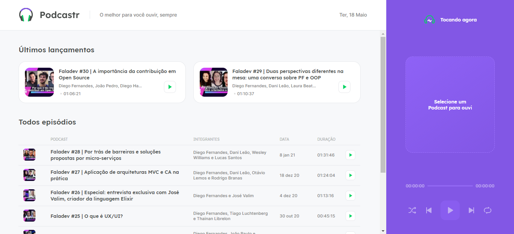

<h1 align="center">Podcastr</h1>

Um app desenvolvido para os amantes de podcast, onde vai ter uma lista com vários podcast que o usuário poderá escutar a vontade.

## 🚀 Tecnologias

Principais tecnologias utilizadas no projeto

- ✔️ NextJs
- ✔️ Axios
- ✔️ rc-slider
- ✔️ react-dom
- ✔️ react
- ✔️ date-fns
- ✔️ TypeScript
- ✔️ Sass

## 📖 Tutorial

Para executar o projeto basta instalar o "yarn install", assim ele realizará as instalações de todas dependências. 

Concluído a instalação, basta rodar o "yarn server" para ele subir o JSON que irá servir como nosso modelo de consumo para uma futura API, e depois o "yarn dev" para rodar o projeto.

