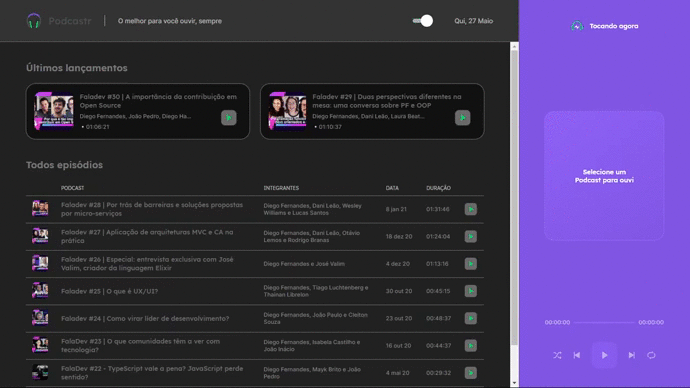

<div align='center'>
    
</div>
<p>Um app desenvolvido para os amantes de podcast, onde vai ter uma lista com vários podcast que o usuário poderá escutar a vontade.</p>



## 🛠 Tecnologias | Dependências

<p>Principais ferramentas que foram usadas na construção do projeto</p>

<h3>Tecnologias</h3>

✔️ NextJs <br>
✔️ React <br>
✔️ Sass <br>
✔️ TypeScript <br>

<h3>Dependências</h3>

✔️ Axios <br>
✔️ date-fns <br>
✔️ polished <br>
✔️ rc-slider <br>
✔️ react-dom <br>
✔️ react-switch <br>
✔️ styled-component <br>

## <h4 align="center"> 
    🚧 Podcastr 🚀 em construção... 🚧 

## pré-requisito

Antes de começar, você vai precisar ter instalado em sua máquina as seguintes ferramentas: 

[Git](https://git-scm.com), [Node.js](https://nodejs.org/en/) e [Yarn](https://classic.yarnpkg.com/en/docs/install/#windows-stable).

Além disso é bom ter um editor para executar o código como [VsCode](https://code.visualstudio.com/download)

### 🎲 Rodando o projeto

```bash

#clone este repositório

$ git clone https://github.com/jonatasvenancio167/podcast.git

## acesse a pasta do projeto no terminal/cmd

$ cd podcast

## instale as dependencias 

$ yarn install

## execute a aplicação em modo de desenvolvimento 
Obs: Para executar a aplicação será necessário dois terminais abertos

1 - Primeiro terminal:

$ yarn server

2 - segundo terminal: 

$ yarn dev

# O servidor iniciará na porta:3000, acesse <http://localhost:3000>

```

